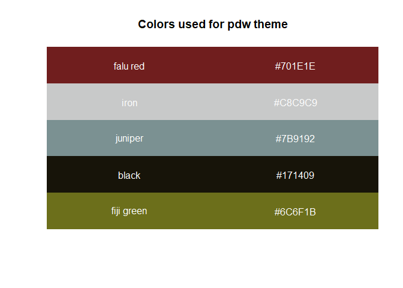
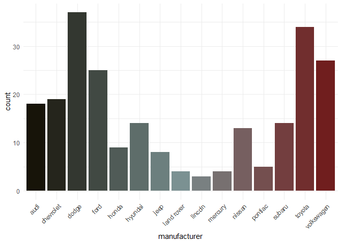
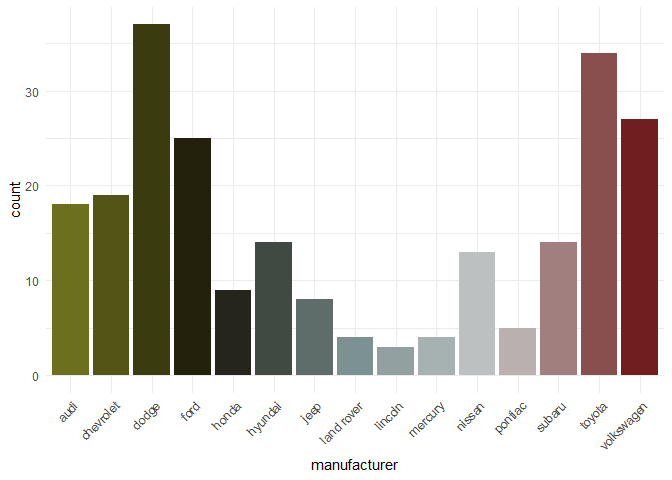

<!-- README.md is generated from README.Rmd. Please edit that file -->

# pdwtheme

<!-- badges: start -->

<!-- badges: end -->

The goal of pdwtheme is to build out the framework for a consistent
color and style theme for visualization work that I do.

### Acknowledgements

**Note:** This is my first package:  
1\. A lot of it was built using the example written up by: @drsimonj
(<https://drsimonj.svbtle.com/creating-corporate-colour-palettes-for-ggplot2>)  
1\. I have also been working through the [R packages
book](https://r-pkgs.org/) as I have been working to try to figure out
how to turn this into a package and is semi robust.

## Installation

And the current version from [GitHub](https://github.com/) with:

``` r
# install.packages("devtools")
devtools::install_github("phildwalker/pdwtheme")

# or via 
remotes::install_github("phildwalker/pdwtheme", ref = "main")
```

## Colors used



## Example

This is a basic example which shows you how to solve a common problem:

``` r
library(pdwtheme)
library(ggplot2)
#> Warning: package 'ggplot2' was built under R version 3.6.3

theme_set(theme_minimal())
## basic example code
```

``` r

# Color by discrete variable using default palette
ggplot(iris, aes(Sepal.Width, Sepal.Length, color = Species)) +
  geom_point(size = 4) +
  scale_color_pdw()
```


## Another example of different palettes

### Using the mixed palette

``` r
# Fill by discrete variable with different palette + remove legend (guide)
ggplot(mpg, aes(manufacturer, fill = manufacturer)) +
    geom_bar() +
    theme(axis.text.x = element_text(angle = 45, hjust = 1)) +
    scale_fill_pdw(palette = "mixed", guide = "none")
```



### Using the main palette

``` r
# Fill by discrete variable with different palette + remove legend (guide)
ggplot(mpg, aes(manufacturer, fill = manufacturer)) +
    geom_bar() +
    theme(axis.text.x = element_text(angle = 45, hjust = 1)) +
    scale_fill_pdw(palette = "main", guide = "none")
```


